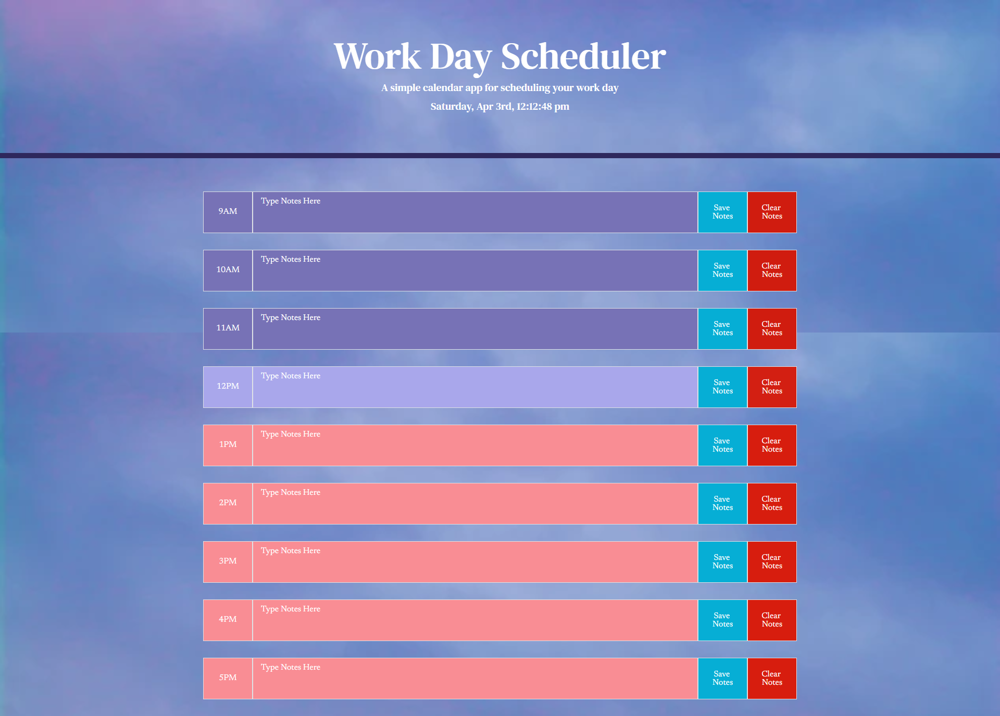

# Work Day Scheduler

## About
This work day scheduler was designed to help organise your day by allowing you to enter notes in different hourly timeslots during the day (from 9am to 5pm). The colour theme chosen is a beach/sunset theme, to make it more welcoming and calming for those stressful working days.

## Functionality
Upon opening the [Work Day Scheduler](https://bdjm94.github.io/Day-planner/), the header displays the current date and has a real-time clock. You are able to enter your own schedule into the different timeslots and have the option of saving notes for reoccuring use. If plans change, you can clear the text that is currently saved and enter your new schedule.

## Work Day Scheduler in Use
Main page of the scheduler showing the different coloured time blocks. 

Below displays the scheduler in use. It shows the functionality of the "Save Notes" and "Clear Notes" buttons - when hitting save notes and refreshing/reopening the page, the notes will remain until they are cleared.

## Credits
- [Bootstrap](https://getbootstrap.com/docs/5.0/customize/overview/)
- [jQuery](https://api.jquery.com/)
- [Moment.js](https://momentjs.com/)
- [Google Fonts](https://www.w3schools.com/howto/howto_google_fonts.asp)